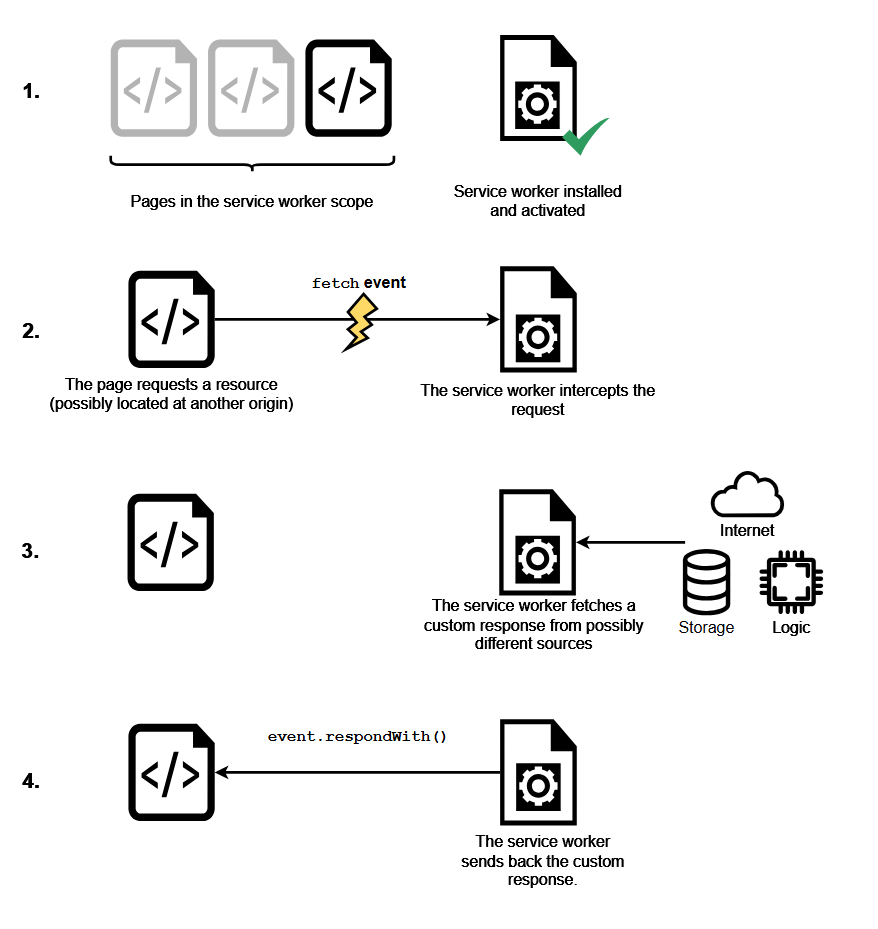
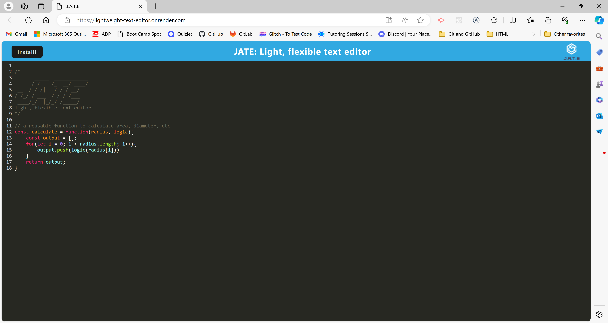
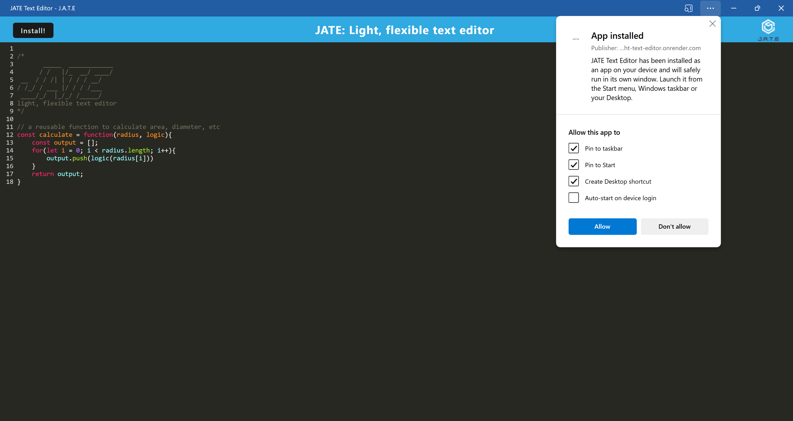

    <!-- PROJECT SHIELDS -->
    
    
    
    
    

 

<h3 align="center">Lightweight Text Editor</h3>

  

    Light, flexible text editor for saving code snippets, with or without internet connection. 
     
     
    <a href="https://github.com/sara-hines/lightweight-text-editor"><strong>Explore the docs »</strong></a>
     
     
    <a href="#usage-and-features">View Features</a>
    ·
    <a href="https://github.com/sara-hines/lightweight-text-editor/issues/new?labels=bug&template=bug-report---.md">Report a Bug</a>
    ·
    <a href="https://github.com/sara-hines/lightweight-text-editor/issues/new?labels=enhancement&template=feature-request---.md">Request a Feature</a>
  

 
<!-- TABLE OF CONTENTS -->

  
Table of Contents

  <ol>
    <li>
      <a href="#description">Description</a>
      <ul>
        <li><a href="#built-with">Built With</a></li>
      </ul>
    </li>
    <li>
      <a href="#getting-started">Getting Started</a>
      <ul>
        <li><a href="#installation">Installation</a></li>
      </ul>
    </li>
    <li>
        <a href="#usage-and-features">Usage and Features</a>
        <ul>
            <li><a href="#service-workers-and-caching">Service Workers and Caching</a></li>
            <li><a href="#using-the-app">Using the App</a></li>
        </ul>
    </li>
    <li><a href="#contributing">Contributing</a></li>
    <li><a href="#license">License</a></li>
    <li><a href="#contact">Contact</a></li>
    <li><a href="#acknowledgments">Acknowledgments</a></li>
  </ol>

 

<!-- ABOUT THE PROJECT -->
## Description

As a developer, you may use any number of tools and platforms daily to help craft quality code and integrate it into your team's codebase. Every developer's workflow is different, but some developers find it helpful to keep a simple text editor on hand in addition to their mainstay IDE (Integrated Development Environment). A basic, low-maintenance text editor is a great place to freely workshop code snippets before integrating them into a shared repository. If you are referencing material from multiple sources, or if you need a place to temporarily store a few helpful lines of documentation, a text editor is a great place to do so. This Progressive Web Application (PWA) text editor is a tailored solution to meet those needs so you can keep your codebase clean while having a place to experiment. 

This PWA app starts and runs quickly, allowing you to quickly reference or modify the code snippet you're working with. It's flexible—it can be used in the browser or downloaded as a desktop/mobile application, and it is available online and offline. Your data is stored and persisted through multiple methods to ensure dependability with and without internet. IndexedDB (through npm package idb) is the primary method of data storage; localStorage is used in case of any browser comparability issue with IndexedDB. To optimize speed and performance, the service worker file uses specific resource caching strategies customized to the application. Finally, webpack helps to make the app light, small, and efficient. 

(<a href="#readme-top">back to top</a>)

### Built With

- [![Webpack][Webpack-badge]][Webpack-url]
- [![IndexedDB][IndexedDB-badge]][IndexedDB-url]
- [![Node][Node.js]][Node-url]
- [![Javascript][JavaScript]][Javascript-url]
- [![VSCode][Visualstudio.com]][VSCode-url]

(<a href="#readme-top">back to top</a>)

<!-- GETTING STARTED -->
## Getting Started

### Installation

Installation is optional for this PWA application. To run the application in the browser, navigate to [https://lightweight-text-editor.onrender.com/](https://lightweight-text-editor.onrender.com/). If you would like to use the application as a desktop app, once you've navigated to the app in the browser, click the install button. You will then be able to access the app from the icon added to your desktop.

(<a href="#readme-top">back to top</a>)

<!-- USAGE EXAMPLES -->
## Usage and Features

 

### Service Workers and Caching

 

 

 

This application uses service workers to help manage the way that resources are served—whether from the network, or from the cache—to help with speed and performance. Service workers intercept requests for resources (such as an index.html, a stylesheet, or a script needed to run the application) and help decide what will be cached, when it will expire, and when a fresh fetch from the network will be performed. MDN has a helpful overview on service workers, and the above diagram from [MDN's 'Using Service Workers' guide](https://developer.mozilla.org/en-US/docs/Web/API/Service_Worker_API/Using_Service_Workers) helps to illustrate the role of the service worker in handling a network request. 

There are many options for configuring service workers, from registering routes to handle certain requests, to defining caching strategies to be used, to handling push notifications. This text editor application uses a few different caching strategies. In order to ensure that the index.html is available offline immediately when the user opens the text editor, warmStrategyCache is used to preload '/index.html' using a CacheFirst strategy. With the CacheFirst strategy, the cache will be used first to try to serve the requested resource (in this case, the index.html). If it isn't available from the cache, then it will be fetched from the network. The combination of warmStrategyCache and the CacheFirst strategy ensure the index.html can be accessed offline quickly. For stylesheets, scripts, and workers, the StaleWhileRevalidate strategy is used, which serves the cached response if available while updating the cache with a fresh response from the network. This ensures the user always gets the cached version quickly while updating the assets in the background. Overall, these caching strategies cut down on unnecessary network requests, provide offline access, and contribute to a fast PWA application.

 

### Using the App

(<a href="#readme-top">back to top</a>)

Upon navigating to [https://lightweight-text-editor.onrender.com/](https://lightweight-text-editor.onrender.com/), you will see a text editor application with the heading "JATE: Light, flexible text editor." No need to navigate through any file structure or create a new document—just start coding! In the below screenshot, a reusable function to calculate area, diameter, etc. has been entered into the text editor for demonstration purposes (this code snippet is courtesy of [Sobit Prasad at FreeCodeCamp](https://www.freecodecamp.org/news/higher-order-functions-in-javascript-explained/#:~:text=A%20higher%20order%20function%20is%20a%20function%20that%20takes%20one,functions%20like%20map%20and%20reduce.)). The built-in JavaScript syntax highlighting improves code readability and helps prevent syntax errors.

 

 

 

If you close the browser and open the application again, your code snippet will have persisted and will be visible when you return, as in the below screenshot. 

 

 

 

If you'd like to use the app as a desktop application, click the install button. The desktop app will open automatically and can be accessed from an icon on your desktop (you may need to allow certain device-specific permissions to add a desktop icon). The below 2 screenshots show the installed desktop app (along with installation options available) and the icon created on the desktop.

 

 

 

 

 

As you work with your reference material, notes, or code snippets, any changes you make will be reflected in the IndexedDB storage and localStorage. In the below screenshot, the reusable function to calculate area and diameter has been changed to a function to just calculate diameter (code snippet courtesy of [Sobit Prasad at FreeCodeCamp](https://www.freecodecamp.org/news/higher-order-functions-in-javascript-explained/#:~:text=A%20higher%20order%20function%20is%20a%20function%20that%20takes%20one,functions%20like%20map%20and%20reduce.)). As in the previous example, the data is saved so it is available when you need it again!

 

 

 

<!-- CONTRIBUTING -->
## Contributing

Contributions are what make the open source community such an amazing place to learn, inspire, and create. Any contributions you make are **greatly appreciated**.

If you have a suggestion that would make this better, please fork the repo and create a pull request. You can also simply open an issue with the tag "enhancement".

Don't forget to give the project a star! Thanks again!

1. Fork the Project
2. Create your Feature Branch (`git checkout -b feature/AmazingFeature`)
3. Commit your Changes (`git commit -m 'Add some AmazingFeature'`)
4. Push to the Branch (`git push origin feature/AmazingFeature`)
5. Open a Pull Request

(<a href="#readme-top">back to top</a>)

<!-- LICENSE -->
## License

This project is covered under the MIT License. You can learn more about this license and its coverage and permissions [here](https://opensource.org/licenses/MIT).

(<a href="#readme-top">back to top</a>)

<!-- CONTACT -->
## Contact

If you have any questions/thoughts about this project or would like to connect, you can reach me at https://github.com/sara-hines/ or sara.marie.hines1@gmail.com. I look forward to hearing from you!

(<a href="#readme-top">back to top</a>)

<!-- ACKNOWLEDGMENTS -->
## Acknowledgments

I referenced MDN's 'Using Service Workers' guide to gain a better understanding of service workers and caching strategies—full citation below.

MDN Web Docs. (2024). Using service workers - Web apis. MDN Web Docs. https://developer.mozilla.org/en-US/docs/Web/API/Service_Worker_API/Using_Service_Workers

This README was made from a modified template created by [@othneildrew](https://github.com/othneildrew). View the original [here](https://github.com/othneildrew/Best-README-Template).

(<a href="#readme-top">back to top</a>)

<!-- MARKDOWN LINKS & IMAGES -->

[IndexedDB-badge]: https://img.shields.io/badge/IndexedDB-E44D26?style=for-the-badge&logo=indexeddb&logoColor=white
[IndexedDB-url]: https://developer.mozilla.org/en-US/docs/Web/API/IndexedDB_API
[Webpack-badge]: https://img.shields.io/badge/Webpack-8DD6F9?style=for-the-badge&logo=Webpack&logoColor=white
[Webpack-url]: https://webpack.js.org/
[Node.js]: https://img.shields.io/badge/node.js-6DA55F?style=for-the-badge&logo=node.js&logoColor=white
[Node-url]: https://nodejs.org
[JavaScript]: https://img.shields.io/badge/javascript-%23323330.svg?style=for-the-badge&logo=javascript&logoColor=%23F7DF1E
[Javascript-url]: https://ecma-international.org/publications-and-standards/standards/ecma-262/
[Visualstudio.com]: https://img.shields.io/badge/Visual%20Studio%20Code-0078d7.svg?style=for-the-badge&logo=visual-studio-code&logoColor=white
[VSCode-url]: https://code.visualstudio.com/
